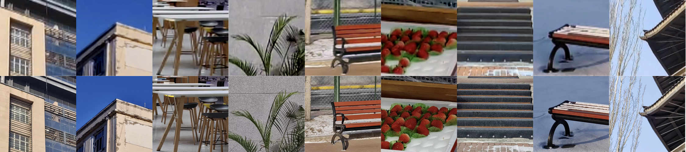

# EAVSR (CVPRW 2023)

PyTorch implementation of [**Benchmark Dataset and Effective Inter-Frame Alignment for Real-World Video Super-Resolution**](https://openaccess.thecvf.com/content/CVPR2023W/NTIRE/papers/Wang_Benchmark_Dataset_and_Effective_Inter-Frame_Alignment_for_Real-World_Video_Super-Resolution_CVPRW_2023_paper.pdf) 

## 1. MVSR4× Datasets

Some samples of proposed MVSR4× dataset.

- **Dataset**
    - we use an ultra-wide camera with a 13mm-equivalent lens and a telephoto camera with a 90mm-equivalent lens to capture LR and HR sequences, respectively.

- **Download**
    - Our **MVSR4× dataset** can be downloaded from this [link](https://pan.baidu.com/s/1WKCllxipLZK3ieUPp1dB3w) with password 'uygh'.

## 2. Framework

Overall pipeline of proposed MultiAdaSTN.

- **Prerequisites**
    - Python $\geqslant$ 3.7, PyTorch $\geqslant$ 1.8 and CUDA $\geqslant$ 11.0.
    - OpenCV, NumPy, tqdm, lpips, scikit-image, mmcv and tensorboardX.
   
    

## 3. Quick Start

### 3.1 Training

- For RealVSR dataset images (×2), modify `dataroot` in `train_x2.sh` and then run:

    [`sh train_x2.sh`](train_x2.sh)

- For MVSR4× dataset images (×4), modify `dataroot` in `train_x4.sh` and then run:
    
    [`sh train_x4.sh`](train_x4.sh)

### 3.3 Inference

- For RealVSR dataset images (×2), modify `dataroot` in `test_x2.sh` and then run:

    [`sh test_x2.sh`](test_x2.sh)

- For MVSR4× dataset images (×4), modify `dataroot` in `test_x4.sh` and then run:
    
    [`sh test_x4.sh`](test_x4.sh)

### 3.4 Note

- You can specify which GPU to use by `--gpu_ids`, e.g., `--gpu_ids 0,1`, `--gpu_ids 3`, `--gpu_ids -1` (for CPU mode). In the default setting, No.0 GPU is used.
- You can refer to [options](./options/base_options.py) for more arguments.

## 4. Citation
If you find it useful in your research, please consider citing:

    @InProceedings{Wang_2023_CVPR,
        author    = {Wang, Ruohao and Liu, Xiaohui and Zhang, Zhilu and Wu, Xiaohe and Feng, Chun-Mei and Zhang, Lei and Zuo, Wangmeng},
        title     = {Benchmark Dataset and Effective Inter-Frame Alignment for Real-World Video Super-Resolution},
        booktitle = {Proceedings of the IEEE/CVF Conference on Computer Vision and Pattern Recognition (CVPR) Workshops},
        month     = {June},
        year      = {2023},
        pages     = {1168-1177}
    }

## 5. Acknowledgement

This repo is built upon the framework of [CycleGAN](https://github.com/junyanz/pytorch-CycleGAN-and-pix2pix), and we borrow some code from [RealVSR](https://github.com/IanYeung/RealVSR) and [BasicVSR++](https://github.com/ckkelvinchan/BasicVSR_PlusPlus), thanks for their excellent work!